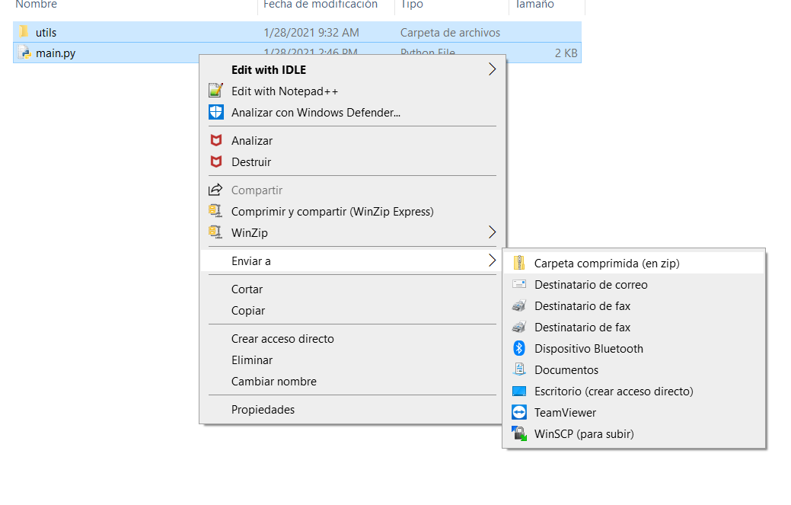

# Compress files for deploying in Cloud Function
This is a quick guideline for compressing files for deploying a zip file in a cloud function.

For compressing a zip file to deploy a cloud function it must be compressed from the place where the source entry function stays, 
for example, in the next picture, it is shown the main.py file this is the place where the compression must be performed.



If a folder is added as a container of the py files, the function will not be deployed appropriately within the cloud function.


# How to deploy a Cloud Function with a zip file using cloud shell

Once the python files are compressed in a zip file it can be deployed in a cloud function using the next cloud shell
statements:

```

export PROJECT_ID=project-id
export LOCATION=us-central1
export DATA_FUSION_INSTANCE=poc-lvp-batch-stream
export BUCKET_NAME_INPUT=gs://poc-lvp-input
export DATA_FUSION_NAMESPACE=default
export DATA_FUSION_PIPELINE=poc-lvp-2-batch-file1
export CLOUD_FUNCTION_SOURCE=gs://poc-lvp-cf-code/cdap_batch_pipeline_trigger_gcs_finalize.zip
export BUCKET_NAME_OUTPUT=gs://poc-lvp-output

gcloud functions deploy cdap_batch_pipeline_trigger_gcs_finalize --region=$LOCATION \
  --entry-point=gcs_to_data_fusion_file_finalize --runtime=python37 --source=$CLOUD_FUNCTION_SOURCE \
  --trigger-event=google.storage.object.finalize --trigger-resource=$BUCKET_NAME_INPUT \
  --set-env-vars=DF_LOCATION=$LOCATION,DF_INSTANCE_NAME=$DATA_FUSION_INSTANCE,\
DF_NAMESPACE=$DATA_FUSION_NAMESPACE,DF_PIPELINE_NAME1=$DATA_FUSION_PIPELINE,DF_PIPELINE_OUT_DIR=$BUCKET_NAME_OUTPUT

```
